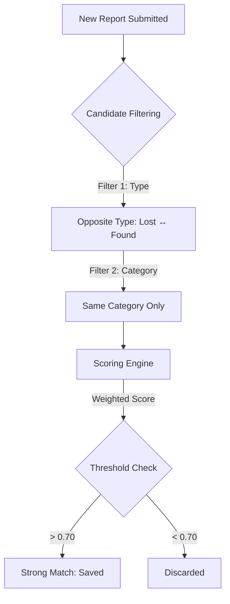

# 🔍 Lost & Found Matching System — Deep Dive

This document explains the technical architecture and logic behind the automatic matching system.

---

## 🏗️ The Philosophy: Hybrid "Smart" Matching

Matching items is a **ranking and retrieval problem**. Instead of relying solely on heavy Machine Learning (ML) models—which can be slow, expensive, and require massive datasets—this system uses a **Hybrid Approach**:

1.  **AI-Generated Metadata (Extraction):** When a report is submitted, we use the Gemini AI to extract structured details (Category, Color, Brand, Distinctive Marks) from the user's raw text.
2.  **Deterministic Heuristics (Comparison):** We use a weighted scoring algorithm to compare these structured fields. This ensures the system is instant, cost-effective, and easy to debug.

---

## 🔄 Core Matching Workflow



### 1. Candidate Filtering (The "Broad Stroke")
To ensure performance, we don't score every item in the database. We filter for:
*   **Type Inversion:** A "Lost" item is only compared against "Found" items.
*   **Category Match:** We only compare items within the same category (e.g., Electronics vs. Electronics).
*   **Status:** Only "Active" items are considered.

### 2. The Scoring Algorithm (The "Fine Detail")
Every pair of reports passes through a scoring engine that calculates a final confidence score from **0 to 100**.

| Component | Weight | Logic |
| :--- | :---: | :--- |
| **Title & Description** | 40% | Uses **Sørensen–Dice coefficient** to compare the text overlap. Handles typos and partial matches. |
| **Color** | 15% | Semantic comparison of color strings (e.g., "Deep Blue" and "Blue" will yield a high score). |
| **Location** | 15% | Comparison of location strings. |
| **Brand** | 10% | Strict or fuzzy comparison of manufacturer names. |
| **Distinctive Marks** | 10% | Looks for unique identifiers like "cracked screen" or "sticker on back." |
| **Time Proximity** | 10% | Penalizes scores if the items were lost/found more than 7 days apart. |

---

## ⚖️ Match Thresholds

Based on the final score, the system takes different actions:

*   **Score > 0.70 (Strong Match):** The match is saved to the database. In the future, this will trigger an automated email/notification to both users.
*   **Score 0.50 - 0.69 (Potential Match):** The match is visible in the dashboard under "Suggestions" but does not trigger aggressive notifications.
*   **Score < 0.50 (No Match):** Ignored to prevent spam and noise.

---

## 🛠️ Technical implementation (Backend)

*   **Library:** `string-similarity` for fast text comparison.
*   **Storage:** A dedicated `Match` collection in MongoDB stores the relationships:
    ```javascript
    {
      lostItem: ObjectId,
      foundItem: ObjectId,
      score: 0.85,
      status: "pending" // Users can "Accept" or "Reject" the match
    }
    ```

---

## 🚀 Future Roadmap

While the MVP uses text-based heuristics, the system is designed to scale into:
1.  **CLIP (Image Matching):** Comparing the actual pixels of images to see if they represent the same object.
2.  **Sentence Embeddings:** Using Vector DBs to find matches based on the *meaning* of sentences rather than just the words used.
3.  **Proximity Logic:** Using Geolocation (latitude/longitude) to calculate physical distance between report locations.
